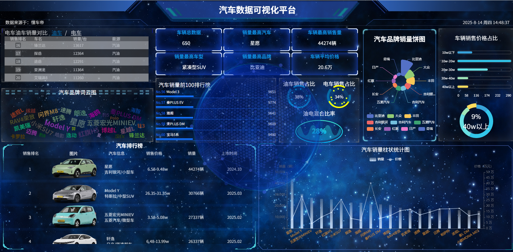

# CarData-big-screen

这是一个基于Vue3+Django5+ECharts+DataV的汽车数据可视化大屏项目
展示数据通过网络爬虫获取，数据来源于：懂车帝

## 后端地址
由于前后端分离，若未启动后端可能导致前端页面中的某些数据无法渲染
https://github.com/HBL3064/CarData-backend

## 启动项目

```sh
npm install
```

### 启动服务器

```sh
npm run dev
```

## 项目展示


